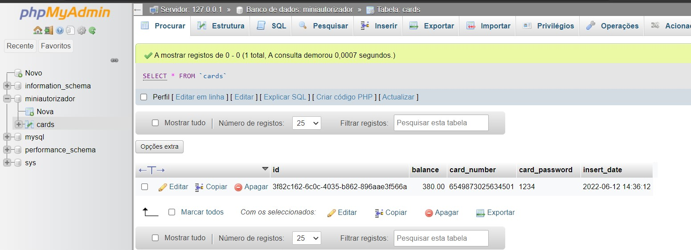

# Mini Autorizador

VR card transaction validation service

# Tecnologias Utilziadas no back-end
Java 11
 
Maven 3.6.1
 
SpringBoot 2.7.0
 
Spring Data
 
Banco MySql
 
JPA
 
Mockito 1.10.19
  
Padrão MVC composto por camadas de entidades, serviços, repositories e controllers
 
# Comandos para rodar a aplicação
1 - Subir o banco de dados MySql que esta configurado para subir com 
    Docker compose que esta na pasta docker
    
- Comando: docker compose up

2 - No pacote raíz (mini-autorizador)
 
- comando: 'mvn package' (será gerado um jar mini-autorizador-1.0.0-SNAPSHOT.jar na pasta ./target)
- Uma vez dentro da pasta target, usar o comando  'java -jar mini-autorizador-1.0.0-SNAPSHOT.jar'
   
Opção utilizando uma IDE
   
- Executar a classe com o main(MiniAutorizadorApplication), irá subir a aplicação na porta 8080
   

# Telas do sistema
- Cadastro de cartão OK

  

- Cadastro de cartão Repetido

  

 

- Visualizar Saldo Cartão

  

 

- Transação OK

  

 

- Transação cartão não encontrado

  

 

- Transação senha inválida

  

 

- Transação saldo insuficiente

  

 

Banco de dados

  

 